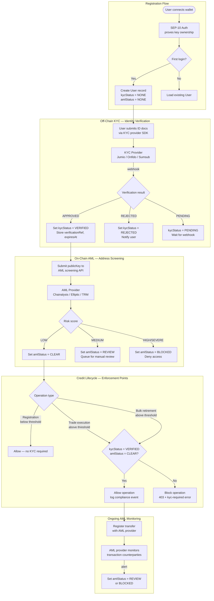

# KYC/AML Integration Design Specification

**Status:** Draft  
**Issue:** Closes #46  
**Created:** 2026-07-16  
**Author:** StellarKraal Engineering  

---

## Table of Contents

1. [Overview](#1-overview)
2. [Provider Survey](#2-provider-survey)
3. [Integration Architecture](#3-integration-architecture)
4. [KYC Gate: Registration and Address Linking](#4-kyc-gate-registration-and-address-linking)
5. [Threshold-Based Triggering](#5-threshold-based-triggering)
6. [Data Minimization and Privacy](#6-data-minimization-and-privacy)
7. [API Design: KYC Status Endpoint](#7-api-design-kyc-status-endpoint)
8. [Error Handling and Edge Cases](#8-error-handling-and-edge-cases)
9. [Open Questions](#9-open-questions)

---

## 1. Overview

Carbon credit markets operating at institutional scale are subject to financial regulations that require participants to be identified and monitored. Specifically:

- **KYC (Know Your Customer):** Verifying the real-world identity of participants before they trade or retire credits above regulatory thresholds.
- **AML (Anti-Money Laundering):** Screening on-chain wallet addresses for connections to sanctioned entities, darknet markets, mixers, or other high-risk counterparties.

StellarKraal uses the Stellar network for on-chain credit lifecycle management (issuance, transfer, retirement). Authentication is already implemented via SEP-10 challenge/response, which cryptographically proves ownership of a Stellar public key. This existing proof-of-key-ownership is the natural anchor point for linking a verified real-world identity to an on-chain address.

### 1.1 Regulatory Context

This specification does not constitute legal compliance advice. The design is informed by commonly applied frameworks:

| Framework | Applicability |
|---|---|
| FATF Travel Rule | Transfers ≥ $1,000 / €1,000 between VASPs require originator/beneficiary data |
| EU MiCA (2024) | Crypto-asset service providers must conduct CDD on customers |
| US FinCEN / BSA | MSBs must apply CDD/EDD for customers with transactions ≥ $3,000 |
| GDPR / UK GDPR | PII collected for KYC is subject to data minimization, retention limits, and erasure rights |

### 1.2 Scope

**In scope:**
- Survey of ≥3 KYC/AML provider options with evaluation criteria
- Architecture showing where checks are enforced in the credit lifecycle
- How Stellar public keys are linked to verified identities
- Threshold-based triggering logic
- Data minimization and GDPR considerations
- Full API design for `GET /users/:id/kyc-status`

**Out of scope:**
- Full implementation of the integration
- Legal compliance review or provider selection
- Real-time sanctions list maintenance

---

## 2. Provider Survey

KYC/AML compliance for a Stellar-based marketplace requires two distinct capabilities:

- **Off-chain KYC:** Document and biometric identity verification of the human or legal entity behind a wallet.
- **On-chain AML (KYT — Know Your Transaction):** Blockchain analytics that screen wallet addresses and transactions for illicit exposure.

These two layers are complementary and are typically sourced from different providers.

### 2.1 Evaluation Criteria

Each provider is assessed against:

| Criterion | Description |
|---|---|
| **Stellar Compatibility** | Does the provider support Stellar addresses or USDC on Stellar natively? |
| **API Quality** | REST API with webhooks, SDKs, good documentation, reasonable SLAs |
| **Privacy Posture** | GDPR-compliant data handling, data minimization, DPA available |
| **Regulatory Coverage** | Geographic reach, supported identity document types, standards compliance |
| **Fraud Detection** | Ability to reject fake or altered identity documents |
| **Integration Complexity** | Effort required for a Node.js/TypeScript backend |

---

### 2.2 Off-Chain KYC Providers

#### 2.2.1 Jumio

**Category:** Identity verification (document + biometric)

**Description:** Jumio provides AI-powered document verification and liveness detection. It supports 5,000+ ID document types across 200+ countries. In independent testing by KYC AML Guide (2026), Jumio achieved 0% fake document acceptance — the strongest fraud-rejection result in its tested cohort.

| Criterion | Assessment |
|---|---|
| Stellar Compatibility | Not native; integrates at the identity layer. The Stellar public key is passed as a custom reference field (`customerInternalReference`) to link verifications to wallet addresses. |
| API Quality | REST API with webhook callbacks for verification results. Mobile SDK for iOS/Android. Well-documented. SLA: 98% uptime. |
| Privacy Posture | GDPR-compliant, SOC 2 Type II, ISO 27001. Data Processing Agreement available. Raw biometric data retained for configurable periods (default 30 days). Supports data deletion via API. |
| Regulatory Coverage | Global — 200+ countries, 5,000+ document types. Covers FATF, MiCA, BSA use cases. |
| Fraud Detection | Best-in-class: 0% fake document acceptance in 2026 testing. Liveness detection defeats photo attacks. |
| Integration Complexity | Medium. REST + webhook. Node.js community SDK available. Requires webhook endpoint on the backend. |

**Pros:**
- Strongest document fraud detection available
- Global document coverage
- Enterprise-grade compliance posture

**Cons:**
- Enterprise pricing (not publicly listed; typically per-verification)
- Biometric data handling requires careful DPA review
- No native blockchain/Stellar integration — address linking must be implemented by the application

---

#### 2.2.2 Onfido (Entrust)

**Category:** Identity verification (document + biometric)

**Description:** Onfido was acquired by Entrust in 2024. It offers document verification, facial biometrics, and liveness detection. In independent 2026 testing, Onfido accepted 10% of fake documents (second-best in the tested pool) but had a 67% genuine document acceptance rate, indicating a higher false-rejection rate that impacts onboarding conversion.

| Criterion | Assessment |
|---|---|
| Stellar Compatibility | Not native; Stellar public key linked via applicant `metadata` field in the Onfido API. |
| API Quality | REST API, webhook callbacks, React Native / iOS / Android SDKs. Good documentation. |
| Privacy Posture | GDPR-compliant, data stored in EU by default, ISO 27001. DPA available. |
| Regulatory Coverage | 195+ countries, broad document type support. Suitable for EU/UK MiCA and US FinCEN contexts. |
| Fraud Detection | Good: 10% fake document acceptance. Liveness check available. |
| Integration Complexity | Low-Medium. Onfido Studio provides no-code workflow configuration. REST API is well-documented with Node.js examples. |

**Pros:**
- Easier integration via Onfido Studio workflow builder
- EU data residency by default — strong GDPR posture
- Lower per-verification cost than Jumio at mid-tier volumes
- Broad SDK support

**Cons:**
- Acquired by Entrust; product roadmap under transition
- Higher false-rejection rate compared to Jumio may hurt UX
- 10% fake acceptance rate is not zero — may require supplementary checks for high-value participants

---

#### 2.2.3 Sumsub

**Category:** Identity verification with reusable KYC

**Description:** Sumsub provides document verification, biometric liveness, AML screening, and a reusable KYC feature that allows a user verified on one platform to share that verification with another (with consent). Webhook-based architecture is well-suited to Node.js.

**Security note:** A security breach was disclosed in January 2026, affecting a support-related internal environment that was compromised from July 2024. The breach did not directly expose customer PII stored in the core verification platform, but implementation teams should conduct a DPA review and assess residual risk before selecting Sumsub for high-sensitivity deployments.

| Criterion | Assessment |
|---|---|
| Stellar Compatibility | Not native; externalUserId field maps Stellar public key to the applicant record. |
| API Quality | REST API with HMAC-signed webhook callbacks. Node.js SDK available. Token-based flow for embedding the SDK in web/mobile. |
| Privacy Posture | GDPR-compliant; DPA available. 2024–2026 security breach requires elevated due diligence. Data deletion API available. |
| Regulatory Coverage | 220+ countries, global document support. Covers FATF, MiCA, FinCEN. |
| Fraud Detection | 80% fake document acceptance in 2026 independent testing — the highest failure rate in the tested cohort. Not suitable as a sole document verification layer without supplementary controls. |
| Integration Complexity | Low. Excellent Node.js documentation. Reusable KYC reduces re-verification friction for returning users. |

**Pros:**
- Reusable KYC reduces user friction for platforms in the same Sumsub network
- Good Node.js SDK and webhook tooling
- Broad global coverage
- Competitive pricing

**Cons:**
- 80% fake document acceptance — worst fraud detection in tested cohort
- Security breach history requires elevated due diligence
- Reusable KYC consent model adds compliance complexity

---

### 2.3 On-Chain AML (KYT) Providers

#### 2.3.1 Chainalysis KYT

**Category:** On-chain transaction monitoring and address screening

**Description:** Chainalysis KYT (Know Your Transaction) is the market-leading blockchain analytics platform. It provides real-time risk scoring for wallet addresses and transaction monitoring. The Address Screening API returns a risk rating of Low / Medium / High / Severe for any wallet address, with exposure categories including sanctioned entities, darknet markets, mixers, ransomware, and stolen funds.

| Criterion | Assessment |
|---|---|
| Stellar Compatibility | Stellar (XLM) and Stellar USDC are supported assets. Wallet screening API accepts Stellar G… addresses. |
| API Quality | REST API (`/v2/users`, `/v1/transfers`, `/v1/addresses`). Webhook-based alert delivery. Well-documented. Compliance dashboard available. |
| Privacy Posture | Chainalysis processes only public on-chain data — no PII. No GDPR exposure for the screening itself. |
| Regulatory Coverage | Used by regulated exchanges globally. FinCEN, OFAC, EU sanctions lists. Covers FATF Travel Rule counterparty screening. |
| Integration Complexity | Medium. REST API requires registration of transfers and users. Node.js HTTP client sufficient — no official SDK required. |

**Pros:**
- Native Stellar support
- No PII involved — only public on-chain data
- Industry standard: used by Coinbase, Binance, major exchanges
- Real-time alerting with configurable thresholds
- OFAC + EU sanctions integrated

**Cons:**
- Enterprise pricing (per-transfer and per-address pricing models)
- Requires registering every transfer — adds latency to transaction flow
- Risk scores are proprietary; limited transparency on scoring methodology

---

#### 2.3.2 Elliptic

**Category:** On-chain blockchain analytics and AML screening

**Description:** Elliptic's AML API provides wallet and transaction screening with "Holistic Screening" — cross-chain tracing that follows funds across bridges and swaps. The API supports batch submissions and returns risk scores with exposure breakdowns by category.

| Criterion | Assessment |
|---|---|
| Stellar Compatibility | Stellar supported as part of multi-chain coverage. |
| API Quality | REST API with batch submission. Customer-level risk summaries available. DPA and compliance tooling included. |
| Privacy Posture | Processes only on-chain public data. No PII stored by Elliptic for screening. |
| Regulatory Coverage | OFAC, EU, UN sanctions. Cross-chain coverage reduces evasion via bridge-hopping. |
| Integration Complexity | Medium. REST API, good documentation. Reduces manual investigation time by up to 90% (per Elliptic). |

**Pros:**
- Holistic cross-chain tracing catches bridge-hopping evasion
- Strong enterprise track record (Revolut, others)
- Batch API reduces integration complexity for bulk operations
- No PII handling

**Cons:**
- Less market share than Chainalysis in pure Stellar deployments
- Pricing not publicly disclosed

---

#### 2.3.3 TRM Labs

**Category:** Blockchain intelligence and wallet screening

**Description:** TRM Labs supports 184+ blockchains for risk screening and 65+ for full investigative tracing. Its Wallet Screening API allows customization of risk tolerance with 155+ configurations, covering ownership risk, counterparty risk, indirect exposure, sanctions, and scams.

| Criterion | Assessment |
|---|---|
| Stellar Compatibility | Stellar included in the 184+ chain screening coverage. |
| API Quality | REST API. Extensive configuration options. Sanctions-specific API available. |
| Privacy Posture | On-chain public data only. No PII. |
| Regulatory Coverage | Broadest multi-chain coverage of the three on-chain providers evaluated. Sanctions API is OFAC/EU/UN aligned. |
| Integration Complexity | Medium. More configuration options than Chainalysis — higher initial setup but more fine-grained control. |

**Pros:**
- Widest chain coverage (184+) — future-proofs multi-chain expansion
- 155+ configurable risk parameters
- Separate Sanctions API for targeted screening
- No PII handling

**Cons:**
- More complex to configure than Chainalysis
- Smaller ecosystem presence in Stellar-specific deployments

---

### 2.4 Provider Comparison Summary

#### Off-Chain KYC

| Provider | Stellar Compat. | API Quality | Privacy Posture | Fraud Detection | Complexity |
|---|---|---|---|---|---|
| **Jumio** | Via reference field | ★★★★★ | ★★★★★ | ★★★★★ (0% fake) | Medium |
| **Onfido/Entrust** | Via metadata field | ★★★★☆ | ★★★★★ | ★★★★☆ (10% fake) | Low-Medium |
| **Sumsub** | Via externalUserId | ★★★★☆ | ★★★☆☆ (breach) | ★★☆☆☆ (80% fake) | Low |

#### On-Chain AML (KYT)

| Provider | Stellar Native | API Quality | Coverage | Chain Breadth | Complexity |
|---|---|---|---|---|---|
| **Chainalysis KYT** | ★★★★★ | ★★★★★ | ★★★★★ | Wide | Medium |
| **Elliptic** | ★★★★☆ | ★★★★☆ | ★★★★★ | Cross-chain | Medium |
| **TRM Labs** | ★★★★☆ | ★★★★☆ | ★★★★★ | 184+ chains | Medium-High |

> **Note:** This specification does not select a provider. The above evaluation is intended to inform an implementation decision made by the team's legal and compliance function.

---

## 3. Integration Architecture

The KYC/AML gate operates as two parallel layers:

1. **Identity Layer (off-chain KYC):** A third-party provider (Jumio, Onfido, or Sumsub) verifies the user's government-issued identity document and biometrics. The result is stored as a `kycStatus` on the `User` record.

2. **Address Layer (on-chain AML):** A blockchain analytics provider (Chainalysis, Elliptic, or TRM Labs) screens the user's Stellar public key for risk exposure. The result is stored as an `amlStatus` on the `User` record.

Both layers must be satisfied before a user is permitted to perform threshold-crossing operations (see Section 5).

### 3.1 Architecture Diagram

The following diagram shows where KYC/AML checks are enforced in the StellarKraal credit lifecycle:



### 3.2 Component Responsibilities

| Component | Responsibility |
|---|---|
| `auth.service.ts` | SEP-10 challenge/response — proves key ownership; no KYC logic |
| `kyc.service.ts` *(new)* | Initiates KYC sessions, handles webhooks, persists KYC status |
| `aml.service.ts` *(new)* | Submits addresses/transfers to AML provider, interprets risk scores |
| `kyc.middleware.ts` *(new)* | Route-level guard — enforces KYC/AML status before protected operations |
| `users.controller.ts` *(new)* | Handles `GET /users/:id/kyc-status` and related endpoints |
| KYC Provider (external) | Document verification, liveness detection, webhook delivery |
| AML Provider (external) | Address risk scoring, transaction monitoring, alert webhooks |
| Prisma / SQLite | Stores KYC status, AML status, references — never raw PII documents |

### 3.3 Data Flow: Linking On-Chain Address to Verified Identity

The critical linkage between a real-world identity and a Stellar public key is established at registration:

1. The user completes SEP-10 auth, which proves they control the private key for their Stellar `publicKey`.
2. The backend creates (or loads) a `User` record where `publicKey` is the primary identity anchor.
3. When KYC is initiated, the backend passes the `User.id` as the `customerInternalReference` (Jumio) or `externalUserId` (Onfido, Sumsub) in the KYC session creation request.
4. The KYC provider's webhook payload includes this reference, allowing the backend to update the correct `User` record without ever joining on PII.
5. The AML provider is called with the `publicKey` string. The AML provider associates risk scores with this address directly.

The database record therefore links: `User.id ↔ User.publicKey ↔ kycVerificationRef ↔ amlRiskScore` — without storing raw identity documents, biometrics, or scanned IDs in StellarKraal's own database.

---

## 4. KYC Gate: Registration and Address Linking

### 4.1 Registration Flow

```
POST /api/auth/login  (SEP-10 — already implemented)
  └── User record upserted with kycStatus = NONE, amlStatus = NONE

POST /api/kyc/initiate  (new)
  └── Creates KYC session with provider
  └── Returns: { sessionToken, redirectUrl }  ← user redirected to provider SDK/hosted flow

[User completes identity verification on provider's hosted page / SDK]

POST /api/kyc/webhook  (new — provider calls this)
  └── Validates webhook signature (HMAC)
  └── Updates User.kycStatus, kycVerificationRef, kycVerifiedAt, kycExpiresAt

GET /api/users/:id/kyc-status  (new)
  └── Returns current KYC + AML status for the user
```

### 4.2 On-Chain Address Linking Flow

The Stellar public key is the identity anchor. The linking sequence is:

```
1. User authenticates via SEP-10
   ← publicKey ownership is cryptographically proven

2. KYC session is created
   ← provider receives { externalUserId: user.id }
   ← no publicKey is sent to KYC provider (data minimization)

3. KYC webhook received
   ← backend matches on externalUserId → user.id → User record
   ← User.kycStatus = VERIFIED, kycVerificationRef = provider's applicant ID

4. AML screening triggered
   ← backend calls AML provider with { address: user.publicKey, asset: "XLM/USDC" }
   ← AML provider returns risk score
   ← User.amlStatus = CLEAR | REVIEW | BLOCKED

5. Compliance state: User.publicKey is now linked to a verified identity
   ← linkage is: DB row (User.id ↔ publicKey ↔ kycVerificationRef)
   ← no PII leaves StellarKraal's systems to the blockchain
```

### 4.3 Re-Verification Triggers

KYC verification has an expiry date. Re-verification is required when:

- `kycExpiresAt` is reached (typically 12–24 months per provider policy)
- The user changes their associated `publicKey` (new address must be re-screened for AML)
- AML provider raises a new alert on a previously CLEAR address
- The user's risk profile changes (e.g., country upgrade to high-risk jurisdiction)

---

## 5. Threshold-Based Triggering

Not all users require KYC. The following thresholds define when KYC/AML checks are enforced:

### 5.1 Threshold Table

| Operation | Threshold | Requirement |
|---|---|---|
| Account registration / login | Any amount | No KYC required |
| View marketplace listings | Any amount | No KYC required |
| Purchase carbon credits | < $1,000 equivalent | No KYC required |
| Purchase carbon credits | ≥ $1,000 equivalent | KYC VERIFIED + AML CLEAR required |
| Sell / list carbon credits | < $1,000 equivalent | No KYC required |
| Sell / list carbon credits | ≥ $1,000 equivalent | KYC VERIFIED + AML CLEAR required |
| Bulk credit retirement | < $3,000 equivalent | No KYC required |
| Bulk credit retirement | ≥ $3,000 equivalent | KYC VERIFIED + AML CLEAR required |
| VASP-to-VASP transfer | Any amount | FATF Travel Rule data required |
| Any operation | Any amount | AML status must not be BLOCKED |

> These thresholds are informational defaults. The implementation team must confirm with legal counsel based on applicable jurisdiction. Thresholds should be configurable via environment variables, not hardcoded.

### 5.2 Threshold Configuration

Thresholds should be driven by environment variables:

```
KYC_TRADE_THRESHOLD_USD=1000
KYC_RETIREMENT_THRESHOLD_USD=3000
KYC_TRANSFER_FATF_THRESHOLD_USD=1000
```

### 5.3 Enforcement Points in the Credit Lifecycle

| Lifecycle Stage | Enforcement |
|---|---|
| **Credit Registration** | No KYC gate. Any authenticated user may register a project. |
| **Credit Issuance** | No KYC gate. Issuance is permissioned by role (ADMIN). |
| **Marketplace Listing** | No KYC gate for listing. Gate applied at trade execution. |
| **Trade Execution** | KYC gate if trade value ≥ `KYC_TRADE_THRESHOLD_USD`. Both buyer and seller must be VERIFIED + CLEAR. |
| **Bulk Retirement** | KYC gate if retirement value ≥ `KYC_RETIREMENT_THRESHOLD_USD`. Retiring party must be VERIFIED + CLEAR. |
| **Withdrawal / Off-Ramp** | KYC gate always applied. FATF Travel Rule metadata required. |

### 5.4 Middleware Design

The KYC enforcement middleware (`kyc.middleware.ts`) will:

1. Extract the authenticated user's ID from the JWT (`req.user.sub`).
2. Load the user's `kycStatus` and `amlStatus` from the database.
3. Evaluate whether the requested operation crosses a threshold.
4. If threshold is crossed and status is not `VERIFIED`/`CLEAR`, respond `403` with a structured error (see Section 8).
5. If `amlStatus` is `BLOCKED`, always deny regardless of threshold.

---

## 6. Data Minimization and Privacy

### 6.1 Principle

StellarKraal applies the GDPR principle of data minimization: only the data strictly necessary for compliance purposes is stored in StellarKraal's own database. Raw identity documents, biometric images, and scanned IDs are never stored by StellarKraal — they remain with the KYC provider.

### 6.2 What StellarKraal Stores

The following fields will be added to the `User` model in Prisma:

| Field | Type | Purpose | PII? |
|---|---|---|---|
| `kycStatus` | String (enum) | Current KYC status: `NONE`, `PENDING`, `VERIFIED`, `REJECTED`, `EXPIRED` | No |
| `kycProvider` | String? | Provider used: `jumio`, `onfido`, `sumsub` | No |
| `kycVerificationRef` | String? | Provider's applicant/verification ID for audit trail | No (opaque ref) |
| `kycVerifiedAt` | DateTime? | When VERIFIED status was last set | No |
| `kycExpiresAt` | DateTime? | When re-verification is required | No |
| `kycRejectionReason` | String? | High-level rejection category (NOT provider's raw reason) | No |
| `amlStatus` | String (enum) | Current AML status: `NONE`, `CLEAR`, `REVIEW`, `BLOCKED` | No |
| `amlScreenedAt` | DateTime? | Last AML screening timestamp | No |
| `amlRiskScore` | String? | Normalized risk rating: `LOW`, `MEDIUM`, `HIGH`, `SEVERE` | No |
| `amlAlertRef` | String? | Provider's alert ID, if any, for escalation | No |

**None of the above fields contain PII.** The user's name, date of birth, document number, and biometric data are stored only with the KYC provider under their DPA.

### 6.3 What Is NOT Stored by StellarKraal

| Data | Where it lives |
|---|---|
| Government-issued ID scans | KYC provider only |
| Selfies / biometric images | KYC provider only |
| Date of birth | KYC provider only |
| Full legal name | KYC provider only (optional: display name is user-provided, not verified) |
| Document numbers | KYC provider only |
| AML transaction graph data | AML provider only |

The `User.email`, `User.phone`, and `User.country` fields already exist in the schema and are user-provided profile data — not KYC verification outputs. They are not populated from KYC provider responses.

### 6.4 Retention Policy

| Data Category | Retention | Deletion Mechanism |
|---|---|---|
| KYC status fields (in StellarKraal DB) | Duration of account + 5 years (regulatory requirement) | Soft-delete + scheduled purge |
| Raw KYC documents (at provider) | Per provider DPA — typically 30–90 days after verification | Deletion request via provider API |
| AML risk scores (in StellarKraal DB) | Duration of account + 5 years | Soft-delete + scheduled purge |
| Compliance audit log entries | 7 years (financial record-keeping standard) | Not eligible for early deletion |

### 6.5 GDPR Rights Handling

| Right | Implementation |
|---|---|
| **Right of access** | `GET /users/:id/kyc-status` returns stored KYC metadata (not raw documents). Raw documents must be requested directly from the KYC provider. |
| **Right to erasure** | On account deletion: KYC status fields are cleared in StellarKraal DB; a deletion request is sent to the KYC provider API. Compliance audit log is retained per retention policy. |
| **Right to rectification** | Re-KYC flow: user can initiate a new verification session to overwrite stale or incorrect status. |
| **Data portability** | `GET /compliance/export` endpoint (Issue #45) covers portfolio data. KYC metadata export is in scope for the same endpoint. |

### 6.6 Data Processing Agreement

Before integrating any provider, a Data Processing Agreement (DPA) must be executed. The DPA must specify:
- Categories of personal data processed
- Sub-processors used by the KYC provider
- Data storage locations (EU residency preferred for GDPR)
- Breach notification timelines (≤72 hours per GDPR Art. 33)
- Data deletion procedures and timelines

---

## 7. API Design: KYC Status Endpoint

### 7.1 Endpoint

```
GET /api/users/:id/kyc-status
```

### 7.2 Authentication and Authorization

- Requires a valid JWT (Bearer token) from SEP-10 login.
- A user may only read their own KYC status (`req.user.sub === params.id`).
- Users with role `ADMIN` may read any user's KYC status.
- Returns `403 Forbidden` if the requesting user attempts to access another user's status without ADMIN role.

### 7.3 Path Parameters

| Parameter | Type | Required | Description |
|---|---|---|---|
| `id` | string (cuid) | Yes | The User's database ID |

### 7.4 Success Response

**Status:** `200 OK`  
**Content-Type:** `application/json`

```jsonc
{
  "userId": "clx1234abcdef",
  "publicKey": "GABCDE...XYZ",

  // Off-chain KYC identity verification status
  "kyc": {
    "status": "VERIFIED",
    // Possible values: "NONE" | "PENDING" | "VERIFIED" | "REJECTED" | "EXPIRED"

    "provider": "onfido",
    // Which provider performed the verification. Null if status is NONE.

    "verifiedAt": "2026-03-15T10:22:00Z",
    // ISO 8601 timestamp of when VERIFIED status was set. Null if not verified.

    "expiresAt": "2027-03-15T10:22:00Z",
    // ISO 8601 timestamp when re-verification is required. Null if not verified.

    "rejectionReason": null
    // High-level rejection category if status is REJECTED.
    // Possible values: "DOCUMENT_UNREADABLE" | "IDENTITY_MISMATCH" | "SANCTIONS_HIT"
    //                  | "UNSUPPORTED_DOCUMENT" | "EXPIRED_DOCUMENT" | "OTHER" | null
  },

  // On-chain AML address screening status
  "aml": {
    "status": "CLEAR",
    // Possible values: "NONE" | "CLEAR" | "REVIEW" | "BLOCKED"

    "riskScore": "LOW",
    // Normalized risk level: "LOW" | "MEDIUM" | "HIGH" | "SEVERE" | null

    "screenedAt": "2026-03-15T10:25:00Z"
    // ISO 8601 timestamp of last AML screening. Null if never screened.
  },

  // Composite gate: whether the user may perform threshold-crossing operations
  "canTransact": true,
  // true iff kyc.status === "VERIFIED" AND aml.status === "CLEAR"

  // Action required by the user, if any
  "requiredAction": null
  // Possible values:
  //   null                     — no action required
  //   "INITIATE_KYC"           — user has never started KYC
  //   "COMPLETE_KYC"           — KYC is PENDING (session started, not yet complete)
  //   "RESUBMIT_KYC"           — KYC was REJECTED; user may re-apply
  //   "RENEW_KYC"              — KYC has EXPIRED; re-verification needed
  //   "CONTACT_SUPPORT"        — AML status is BLOCKED; user must contact support
  //   "PENDING_MANUAL_REVIEW"  — AML status is REVIEW; awaiting compliance team
}
```

### 7.5 Error Responses

| HTTP Status | Error Code | Description |
|---|---|---|
| `400 Bad Request` | `INVALID_USER_ID` | The `:id` path parameter is not a valid cuid |
| `401 Unauthorized` | `MISSING_AUTH` | No Bearer token provided or token is invalid/expired |
| `403 Forbidden` | `ACCESS_DENIED` | Requesting user is not the resource owner and does not have ADMIN role |
| `404 Not Found` | `USER_NOT_FOUND` | No user exists with the given ID |
| `500 Internal Server Error` | `INTERNAL_ERROR` | Unexpected server error |

**Error response shape:**

```jsonc
{
  "error": "ACCESS_DENIED",
  "message": "You do not have permission to view this user's KYC status."
}
```

### 7.6 Supporting Endpoints (not fully specified here)

These endpoints are needed to complete the KYC flow but are out of scope for this specification's detailed design. They are listed for implementation planning:

| Method | Path | Purpose |
|---|---|---|
| `POST` | `/api/kyc/initiate` | Creates a KYC session with the provider; returns session token/redirect URL |
| `POST` | `/api/kyc/webhook` | Receives webhook callbacks from the KYC provider (signature-verified) |
| `POST` | `/api/aml/screen` | Triggers on-demand AML screening for a user's public key |
| `POST` | `/api/aml/webhook` | Receives alert webhooks from the AML provider |

### 7.7 Proposed Prisma Schema Extension

```prisma
model User {
  // ... existing fields ...

  // KYC / AML compliance fields
  kycStatus          String    @default("NONE")   // NONE | PENDING | VERIFIED | REJECTED | EXPIRED
  kycProvider        String?                       // jumio | onfido | sumsub
  kycVerificationRef String?                       // Provider's applicant/verification ID
  kycVerifiedAt      DateTime?
  kycExpiresAt       DateTime?
  kycRejectionReason String?

  amlStatus          String    @default("NONE")   // NONE | CLEAR | REVIEW | BLOCKED
  amlScreenedAt      DateTime?
  amlRiskScore       String?                       // LOW | MEDIUM | HIGH | SEVERE
  amlAlertRef        String?

  @@index([kycStatus])
  @@index([amlStatus])
}
```

---

## 8. Error Handling and Edge Cases

### 8.1 KYC Provider Webhook Failures

- All inbound webhooks must validate HMAC signatures before processing. Invalid signatures return `400` and are logged but not processed.
- Webhook processing is idempotent: if the same webhook event is received twice (provider retry), the second call is a no-op (check `kycVerificationRef` for duplicate).
- If webhook processing fails (e.g., DB error), respond `500` to trigger provider retry. Log the failure for alerting.

### 8.2 AML Screening Latency

- AML screening is performed asynchronously after KYC verification. There is a window where `kycStatus = VERIFIED` and `amlStatus = NONE`.
- During this window, `canTransact = false` and `requiredAction = "PENDING_MANUAL_REVIEW"` (or a new `PENDING_AML` value if preferred).
- AML screening for a newly verified address should be triggered immediately after the KYC webhook sets status to VERIFIED.

### 8.3 AML REVIEW Status (Manual Review)

- When the AML provider returns `MEDIUM` risk, the system sets `amlStatus = REVIEW`.
- The user cannot transact above thresholds until a compliance team member manually clears or blocks the account.
- An internal alert (e.g., Slack webhook per Issue #36 anomaly detection) should be fired on any `REVIEW` or `BLOCKED` transition.

### 8.4 KYC Expiry

- A scheduled job (cron) runs nightly to find users where `kycExpiresAt < NOW()` and sets `kycStatus = EXPIRED`.
- Expired users lose the ability to transact above thresholds until re-verification is complete.
- The `requiredAction: "RENEW_KYC"` signal in the status response guides the frontend to prompt re-verification.

### 8.5 Address Reuse / Multiple Public Keys

- The current data model supports one `publicKey` per `User`. If multi-key support is added in future, each key must be independently AML-screened.
- Any key rotation (user migrates to a new wallet) must trigger a new AML screening for the new address before threshold-crossing operations are permitted.

---

## 9. Open Questions

The following questions are unresolved and should be addressed during implementation planning:

1. **Provider selection:** Which KYC provider and which AML provider will be contracted? This requires legal/compliance sign-off and commercial negotiation. Fraud detection scores and the Sumsub security breach history are key inputs to this decision.

2. **Threshold jurisdiction:** The thresholds in Section 5.1 are informational defaults derived from FATF and FinCEN guidance. The applicable regulatory jurisdiction(s) for StellarKraal must be confirmed by legal counsel before implementing enforcement logic.

3. **FATF Travel Rule implementation:** For VASP-to-VASP transfers, the Travel Rule requires sharing originator/beneficiary PII between institutions. This specification does not design that flow. A follow-up issue should be created if StellarKraal operates as a VASP.

4. **Re-verification UX:** When KYC expires or is rejected, the user must restart the verification flow. The frontend UX for this re-entry path is not designed here.

5. **Sanctions-only screening:** Should all users (even below thresholds) be screened against OFAC/EU sanctions on first login? This is a lower-cost operation than full KYC and may be legally required regardless of transaction size. This could be implemented as a lightweight first step before full KYC.

6. **Multi-key wallets:** If a user operates multiple Stellar addresses (e.g., a trading account and a retirement account), does each address require independent AML screening? The current one-to-one model may need to evolve.

7. **Webhook endpoint security:** The KYC and AML webhook endpoints must be reachable from the provider's IP ranges. Firewall rules and IP allowlisting strategy needs to be defined for the production deployment.

8. **Audit log schema:** Section 6.4 references a compliance audit log. The schema and storage location for this log are not defined in this document. This should be specified before implementation, as it affects the data retention implementation.
